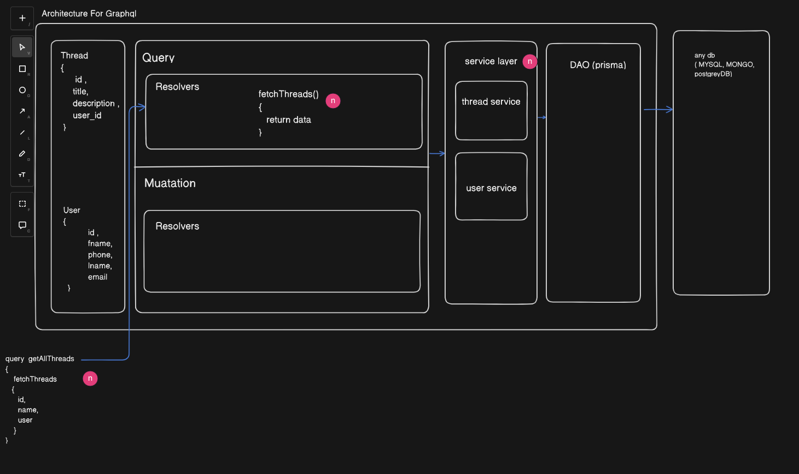
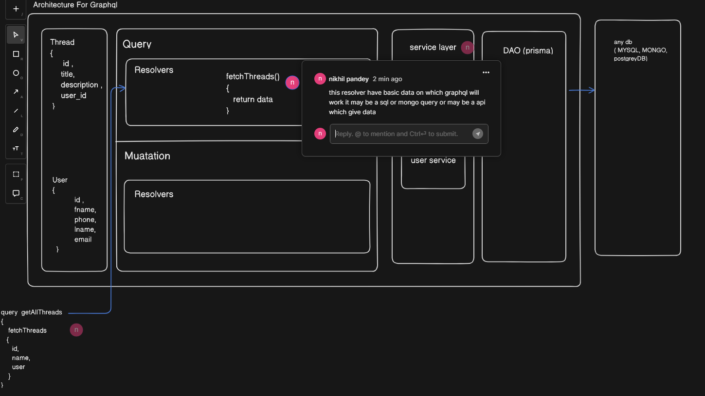
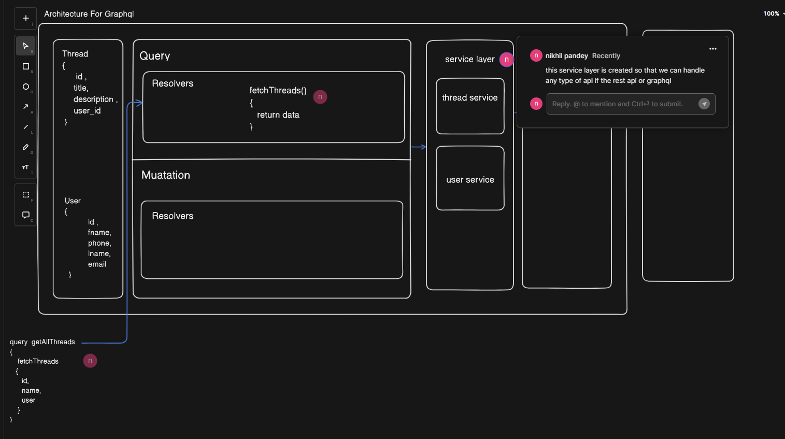
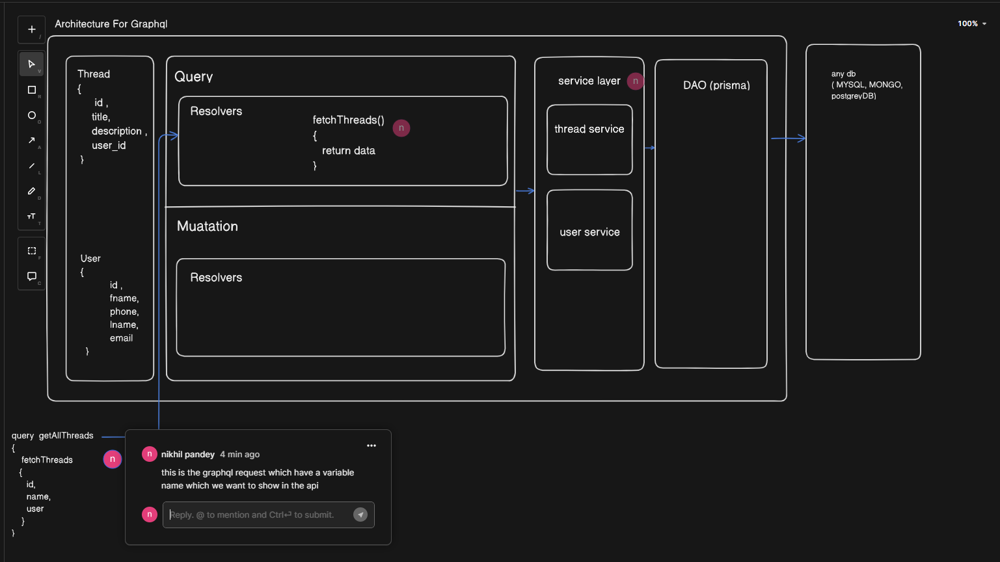

# graphql

## Architecture of graphql 
1. This is a basic Architecture of graphql

2. If sceenshort are not clear thne you can go to this [url](https://app.eraser.io/workspace/g8qRKRVaoXoOxIYgnyk3?origin=share) 

## Package user
 1. express
 2. node js 
 3. graphql (apollo server)
 4. typescript 

## How to run
 1. npm i 
 2. npm run dev 
 3. [normal url](http://localhost:4000/) 
 4. [graphql url](http://localhost:4000/graphql) 

